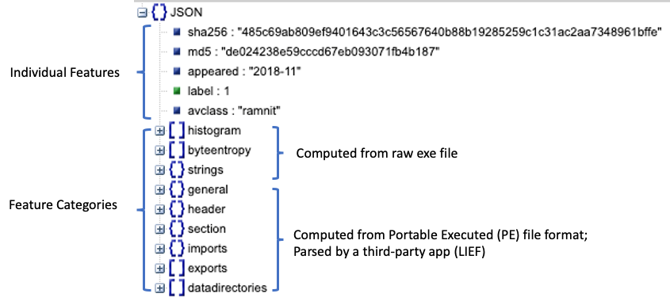
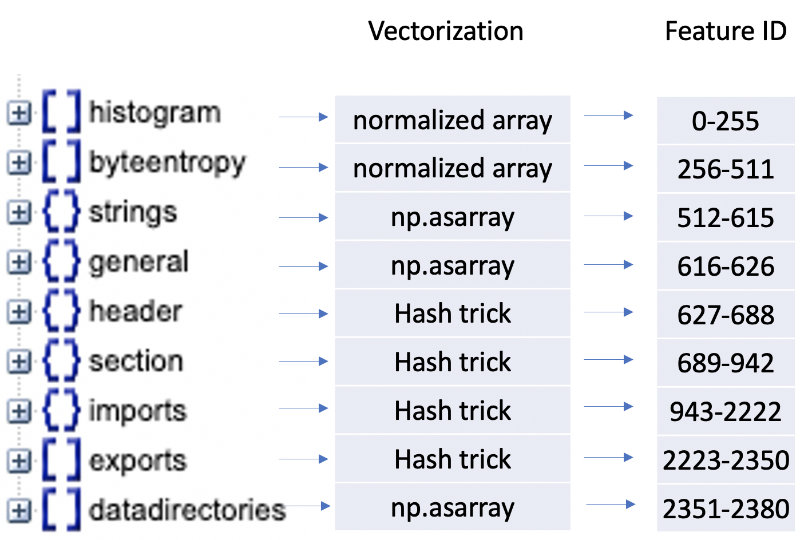
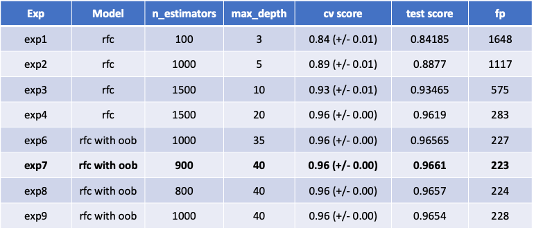
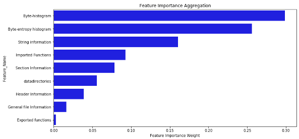

# 
<h1>
Capstone Report - FileW@re
</h1>
<h3>
(by Wilson Alberto Torres)
</h3>

# 1. Introduction

Cybersecurity is defined as the protection of computer and network systems from damage to their hardware, software and electronic information. Malicious software, or malware, arguably constitutes one of the most significant categories of threats within cybersecurity. SP 800-83 (Guide to Malware Incident Prevention and Handling for Desktops and Laptops, July 2013) defines malware as *“a program that is covertly inserted into another program with the intent to destroy data, run destructive or intrusive programs, or otherwise compromise the confidentiality, integrity, or availability of the victim’s data, applications, or operating system.”* Hence, we are concerned with the threat malware poses to application programs, to utility programs, such as editors and compilers, and to kernel-level programs. We are also concerned with its use on compromised or malicious Web sites and servers, or in especially crafted spam e-mails or other messages, which aim to trick users into revealing sensitive personal information.

This capstone project aims at applying the concepts learnt in the data science immersive course into cybersecurity. The main objective is to generate a machine learning model to predict whether a file is malware. This project uses the dataset from the research project named as Endgame Malware Benchmark for Research *EMBER* (https://github.com/endgameinc/ember). This dataset contains 1 million records which include malware (400K records), benign (400K), and unlabeled (200K). 

Each record of the the dataset contains individial and categorical features. The former includes, hash values (sha256 & md5) to idenfity the malware or file used, date when a malware appeared, label, and malware name (avclass). The latter is related to information extracted from the type of file, it has list and dictionary data structures. A illustration of this structure is presented as follows:

**Note**: The datasets used for this experiments are not uploaded because their sizes are considerably large.

# 2. Data Preprocessing

The preprocessing part started with the vectorization that basically utilise a script from *EMBER's* project. This particular process is performed in the following jupyter notebook: [vectorization](./1.Vectorization.ipynb). This process is shown below:

In addition to this, some pleliminar analysis was done in [Exploratory Data Analysis](./2.EDA-Visuals.ipynb). Due to the time limitation and resources, a sample (100K records) from the original dataset was taken so the modeling experiments were pratically computed, details of this is illustrated in [Sample generation](./3.exp-gen-sampl.ipynb).

# 3. Model experiments

This project explored three machine learning models, Random Forest Classifier (RFC) , XGBoost, and PCA - Logistic Regression. In the case of RFC, nine experiments were conducted, from where *exp7* seems to be the best model out of them. Image below presents a summary of these experiments, highlighting their important parameters and results. Specific details of *exp7* is elaborated in the following notebook: [Model Selection](./4.exp-model7-rfc.ipynb).

In further experiments, the XGBoost and PCA - Logistic Regression models, we can refer to the notebooks ([XGBoost](./6.exp-xgboost-1.ipynb)), and  ([PCA-LogisticRegression](./5.exp-PCA-LogRegression.ipynb)), respectively. These models need certain optimatization to achieve better results.

# 4. Challenges and Conclusions

Two main challenges were undergone, one related to the vectorization and handling a big dataset (1 Million, 2381). The vectorization was managed by reverse engineering where several scripts (from *EMBER's* project) were evaluated to identify the 2381 features. This approach is describe in Section 2 of this report.

In terms of the dataset size, different strategies were explored. For instance, Dask application was used to try to execute the original dataset. Principal Component Analysis (PCA) was performed to keep 95% of the variance from the entire dataset. However, these strategies were still computational expensive. Another approach was to take a random and stratified sample from the initial dataset, from which most of the experiments could perfom in a reasonable amount of time and ultimately achieve the project's objectives. Additionally, cloud technology platforms (Amazon AWS, Google Cloud, and Microsoft Azure) were utilised to perform most of the experiments.

The results conclude (*exp7*) that *Byte-histogram*, *Byte-entropy histogram*, and *String information* are strong predictor categories, which accounts for more that 70% of the entire features, as illustrated below:

This indicates that statistics about the type of file are strong predictors since those predictor categories collect meta-data of a particular file, for example, bytes distribution and randomness.
